## 🚀 Instalação e Execução (Backend)

Este projeto utiliza [Laravel Sail](https://laravel.com/docs/sail), que fornece um ambiente de desenvolvimento local completo baseado em Docker.

### Pré-requisitos

- [Docker](https://www.docker.com/get-started)
- [Docker Compose](https://docs.docker.com/compose/install/) (geralmente incluído no Docker Desktop)

### Passos para Instalação

1.  **Clone o repositório e entre no diretório do Laravel:**

    ```bash
    git clone https://github.com/eyecarehealth/take-home-laravel-vue
    cd take-home-laravel-vue/laravel
    ```

2.  **Instale as dependências do Composer:**

    > O Sail utilizará a imagem Docker do PHP para executar o Composer. Você não precisa ter o PHP ou o Composer instalados localmente.

    ```bash
    docker run --rm \
        -u "$(id -u):$(id -g)" \
        -v "$(pwd):/var/www/html" \
        -w /var/www/html \
        laravelsail/php83-composer:latest \
        composer install --ignore-platform-reqs
    ```

3.  **Copie o arquivo de ambiente:**

    ```bash
    cp .env.example .env
    ```

4.  **Inicie os containers do Sail em modo detached:**

    ```bash
    ./vendor/bin/sail up -d
    ```

5.  **Gere a chave da aplicação:**

    ```bash
    ./vendor/bin/sail artisan key:generate
    ```

6.  **Execute as migrações e os seeders:**
    > Isso criará a estrutura do banco de dados e populará as tabelas com dados de exemplo para facilitar os testes.
    ```bash
    ./vendor/bin/sail artisan migrate --seed
    ```

Pronto! A aplicação backend estará em execução e acessível em `http://localhost`.

---

## 🧪 Testando a API

A API pode ser testada utilizando a coleção do Postman incluída no projeto ou executando a suíte de testes automatizados.

### 1. Usando a Coleção do Postman

1.  Na raiz do subdiretório `laravel`, você encontrará o arquivo `Exames_API.postman_collection.json`.
2.  Importe este arquivo no seu cliente Postman.
3.  A coleção já contém as requisições para todos os endpoints da API, com exemplos de corpo (body) para as requisições `POST` e `PUT`.

#### Principais Endpoints

- `GET /api/exames`: Lista todos os exames.
- `POST /api/exames`: Cria um novo exame.
- `GET /api/pacotes`: Lista todos os pacotes com seus exames.
- `POST /api/pacotes`: Cria um novo pacote com exames associados.
- `POST /api/pacotes/{id}/exames`: Adiciona novos exames a um pacote existente.
- `POST /api/gerar-impressao`: Gera o PDF da solicitação.
  - **Exemplo de corpo (body):**
    ```json
    {
    	"exames": [1, 2],
    	"pacotes": [3]
    }
    ```

### 2. Executando os Testes Automatizados (PHPUnit)

Para rodar a suíte de testes automatizados do Laravel, que valida as regras de negócio e o funcionamento dos endpoints, execute o seguinte comando:

```bash
./vendor/bin/sail artisan test
```

<p align="center" id="top">
    
</p>

## ✨ Frontend (Vue.js 2)

A interface do sistema foi construída com Vue.js 2, proporcionando uma experiência de usuário reativa e amigável para gerenciar exames e pacotes.

### Dashboard

A página inicial apresenta os principais módulos do sistema: Solicitação de Exames, Gestão de Exames e Gestão de Pacotes.

<p align="center" id="top">
    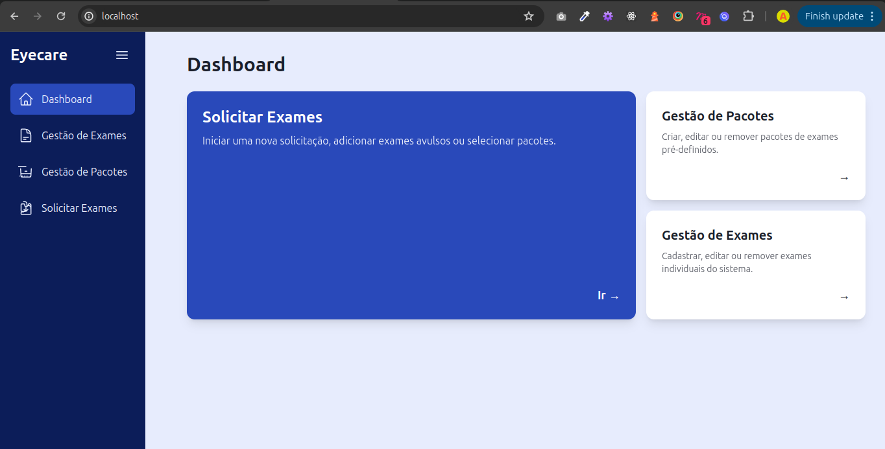
</p>

### Gestão de Exames

Nesta tela, o usuário pode visualizar, criar, editar e remover os exames que serão utilizados nas solicitações e pacotes.

<p align="center" id="top">
    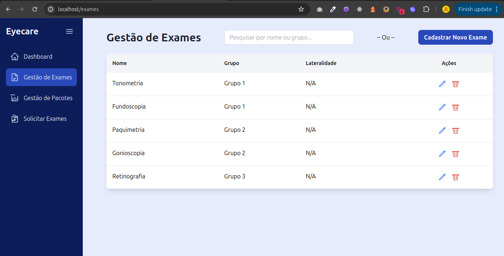
</p>

O formulário para criar ou editar um exame é apresentado em um modal, simplificando o fluxo de trabalho.

<p align="center" id="top">
    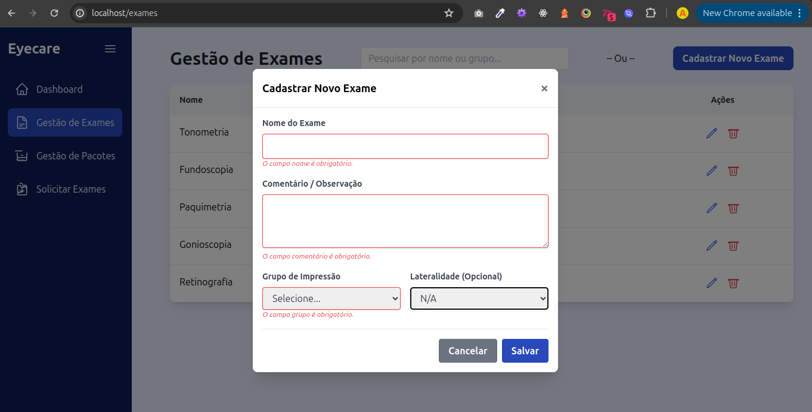
</p>

### Gestão de Pacotes

Esta seção permite o gerenciamento de pacotes, que são agrupamentos de exames para agilizar a solicitação.

<p align="center" id="top">
    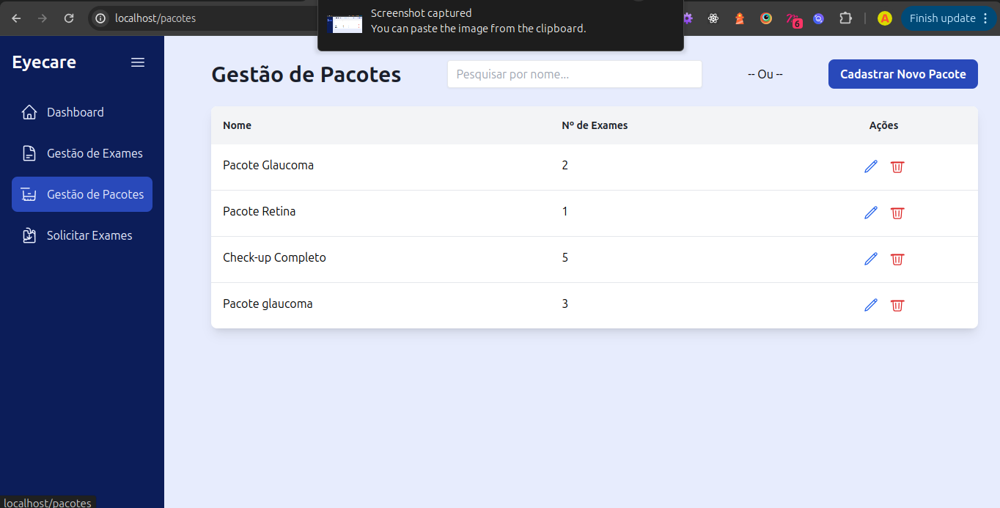
</p>

Assim como na gestão de exames, um modal é utilizado para criar e editar os pacotes, permitindo associar os exames desejados.

<p align="center" id="top">
    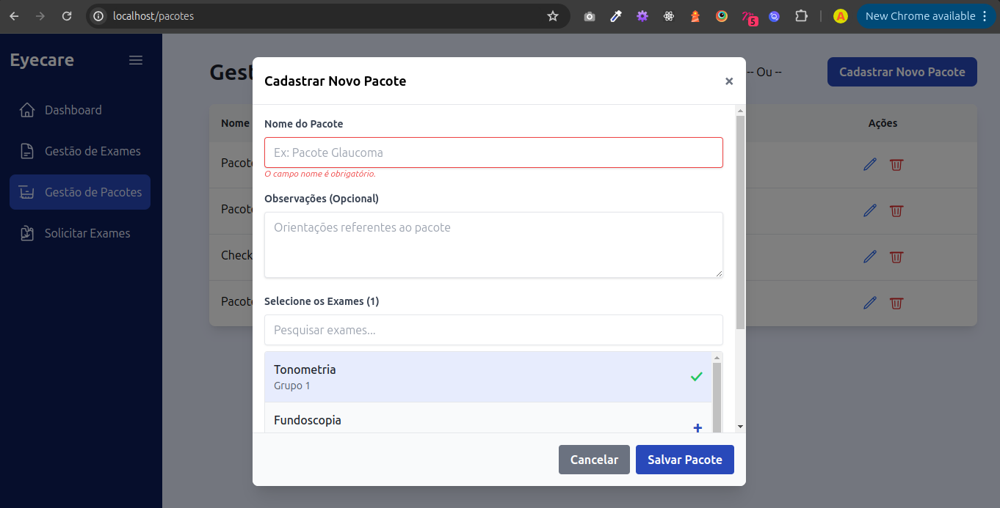
</p>

### Solicitação de Exames

A tela principal da aplicação, onde o médico pode solicitar exames de forma avulsa ou através de pacotes pré-definidos, e então gerar a impressão.

<p align="center" id="top">
    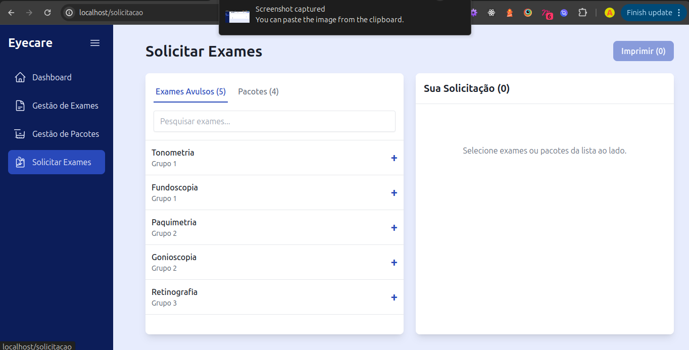
</p>

### Telas Mobile

O sistema é totalmente responsivo, garantindo uma experiência de uso consistente em dispositivos móveis.

**Navegação e Dashboard Mobile**

A navegação mobile é intuitiva, com um menu inferior que dá acesso rápido às principais seções. O dashboard se adapta ao formato de tela menor, mantendo a clareza das informações.

<p align="center" id="top">
    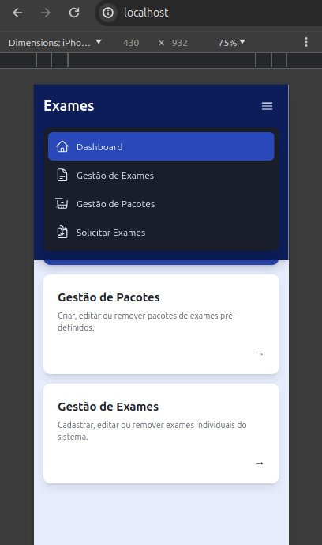
    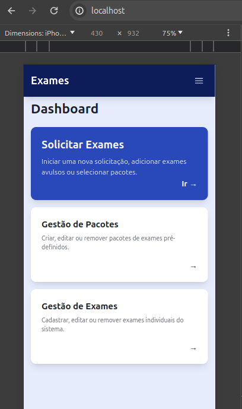
</p>

**Gestão de Exames e Pacotes Mobile**

As telas de gestão de exames e pacotes são otimizadas para toque, facilitando a visualização e manipulação dos dados.

<p align="center" id="top">
    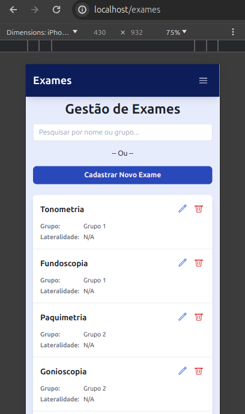
    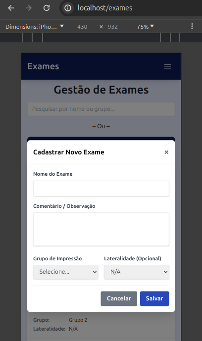
</p>

<p align="center" id="top">
    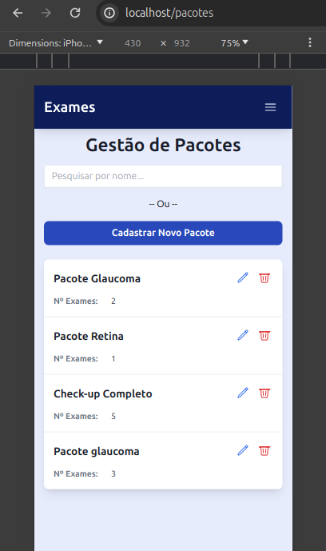
    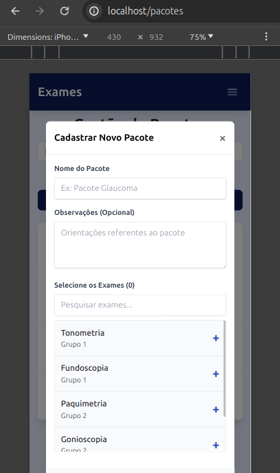
</p>

**Solicitação de Exames Mobile**

O processo de solicitação de exames também foi adaptado para dispositivos móveis, permitindo que o médico adicione exames avulsos ou pacotes de forma rápida.

<p align="center" id="top">
    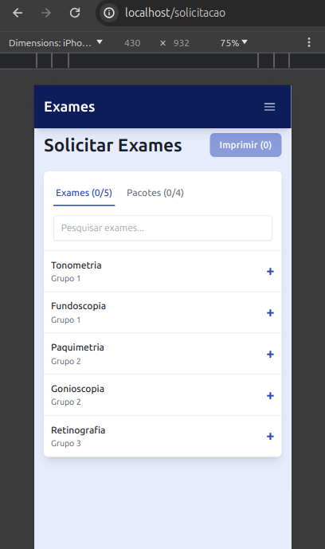
    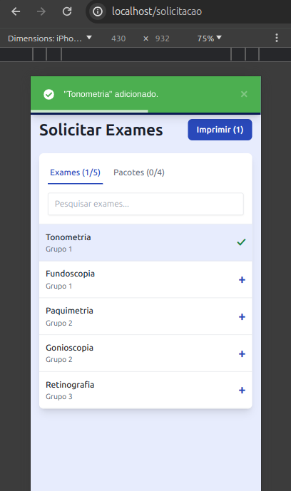
</p>

<p align="center" id="top">
    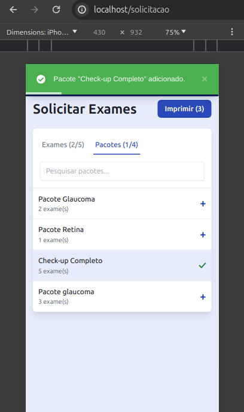
</p>

---
